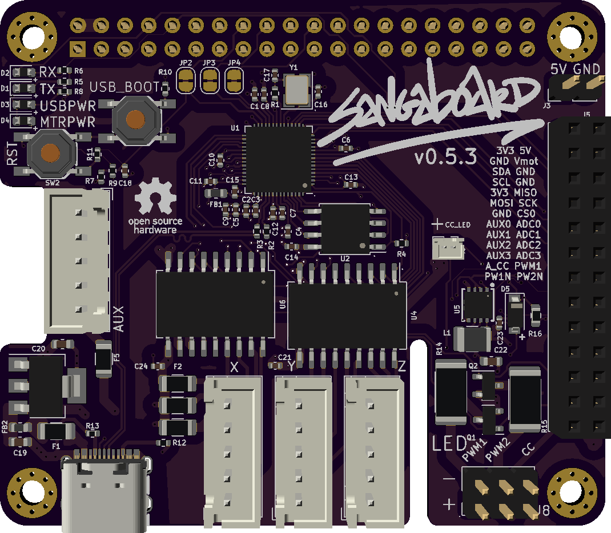

# Powering the LED

You can carry on assembling your microscope until the assembly instructions asks you to connect the illumination PCB.

>! As our LED has a resistor you have access to a Sangaboard v0.5 you shouldn't use the same pins as the illumination PCB

## Locate +5v and ground on your electronics {pagestep}

* You need to attach the black wire to ground
* You need to attach the red  wire to +5v

As you are customising your microscope electronics, where you connect the LED will depend on what combination of electronics boards you have.

Some options are below:

### For the Raspberry Pi:

### For the Sangaboard v0.5:

Use the connector in the top right corner of this image:

